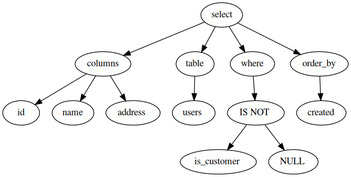

# sql-ast-generator
Generate AST from simple SQL statements.

## Usage

```bash
$ cat ./statement.sql | ./naive-sql-parser > ./statement.dot
$ # Visualize graph:
$ dot -Tpng ./statement.dot > ./statement.png
```
## Results


## Caveats

* Lexer is naïve, floating points, signed numbers and nested qualifiers are not supported;
* Parser does not support complex where clauses. Only one statement is supported.
