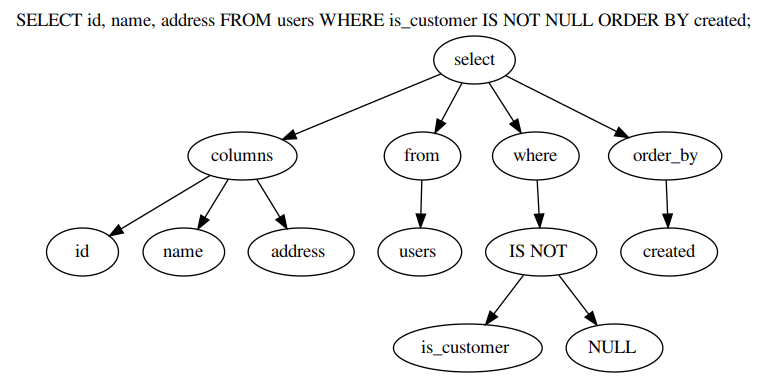
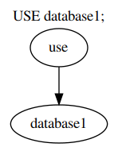

# sql-ast-generator
Generate AST from simple SQL statements.

## Usage

```bash
$ cat ./statement.sql
SELECT id, name, address FROM users WHERE is_customer IS NOT NULL ORDER BY created;
$ cat ./statement.sql | ./naive-sql-parser > ./statement.dot
$ # Visualize graph:
$ dot -Tpng ./statement.dot > ./statement.png
```
## Results






## Tests
Put your sql statements in `test/queries.sql`, one in each line. Run `check` target to generate `.dot` graph description files.
```bash
$ make check TESTS=tst-sql-parser
```
In case you also have graphviz installed, you can also visualize the results. Run `make check` to execute all check targets. This will generate png images from graphs.

```bash
$ make check 
$ # or make check TESTS=visualize.sh
```

## Windows Support
Visual Studio 2017 Solution is provided in win32 directory.

## Caveats

* Lexer is naïve. Floating point and signed numbers are not supported. Also support for name literals is minimal;
* Parser does not support complex where clauses. Only one statement is supported. (Having more than one statement requires context, like operator precedence);
