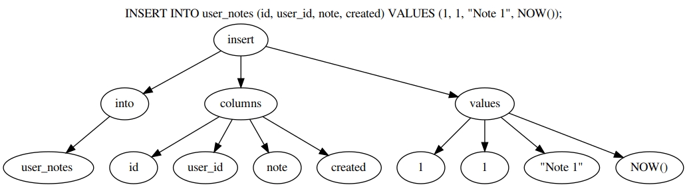

# sql-ast-generator
Generate AST from simple SQL statements.

## Usage

```bash
$ cat ./statement.sql
SELECT id, name, address FROM users WHERE is_customer IS NOT NULL ORDER BY created;
$ cat ./statement.sql | ./naive-sql-parser > ./statement.dot
$ # Visualize graph:
$ dot -Tpng ./statement.dot > ./statement.png
```

Please note that `statement.dot` file contains graph representation which can be visualized by graphviz:

```
digraph G {
	graph [
		label = "INSERT INTO user_notes (id, user_id, note, created) VALUES (1, 1, \"Note 1\", NOW());"
		labelloc = t
	]
	subgraph {
		"node_5" [label="insert"]
		"node_6" [label="into"]
		"node_7" [label="user_notes "]
		"node_8" [label="columns"]
		"node_9" [label="id"]
		"node_10" [label="user_id"]
		"node_11" [label="note"]
		"node_12" [label="created"]
		"node_13" [label="values"]
		"node_14" [label="1"]
		"node_15" [label="1"]
		"node_16" [label="\"Note 1\""]
		"node_17" [label="NOW()"]
		node_5 -> node_6
		node_5 -> node_8
		node_5 -> node_13
		node_6 -> node_7
		node_8 -> node_9
		node_8 -> node_10
		node_8 -> node_11
		node_8 -> node_12
		node_13 -> node_14
		node_13 -> node_15
		node_13 -> node_16
		node_13 -> node_17
	}
}
```

## Results



## Documentation
Simplified SQL statements are being parsed by a non-deterministic state machine. This machine is documented in [doc/state-machine.dot](doc/state-machine.dot) file (see [this image](doc/state-machine.png)).

## Tests
Put your sql statements in `test/queries.sql`, one in each line. Run `check` target to generate `.dot` graph description files.
```bash
$ make check TESTS=tst-sql-parser
```
In case you also have graphviz installed, you can also visualize the results. Run `make check` to execute all check targets. This will generate png images from graphs.

```bash
$ make check 
$ # or make check TESTS=visualize.sh
```

## Windows Support
Visual Studio 2017 Solution is provided in win32 directory.

## Caveats

* Lexer is naïve. Floating point and signed numbers are not supported. Also support for name literals is minimal;
* Parser does not support complex where clauses. Only one statement is supported. (Having more than one statement requires context, like operator precedence);
* Parser does not support nested queries (insert into x (select from y));
* Parser does not support `HAVING`, `*` and many other features which were not requested;
* Semantics is not included (e.g. parser does not care about field and value count match);
